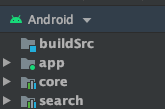

# Android LastFM kotlin project

This repo represents the implementation of a basic list-detail app created to fetch data from the last fm api.

## Purpose
The purpose of this implementation is to play with Dagger 2 and Dagger Android.

## Architecture and Implementation approach
I've decided to go for the presentation pattern `MVP` and `Clean Architecture` to decouple layers and concerns as much as possible.

My goal was to setup Dagger 2 in a project that uses multiple features-modules: `core`, `search` and `app`.

If you would like to see a sample implementation with `MVVM + CleanArch + Koin + LiveData`, feel free to go to this repo https://github.com/claucookie/kotlin-repos-android

## Tools

- Kotlin : https://kotlinlang.org/
- Glide : https://github.com/bumptech/glide
- Retrofit 2 : https://github.com/square/retrofit
- Dagger 2 : https://github.com/square/dagger
- RxJava 2 : https://github.com/ReactiveX/RxJava

## Testing

A few unit tests added to Presentation, Data, and Domain layers.

